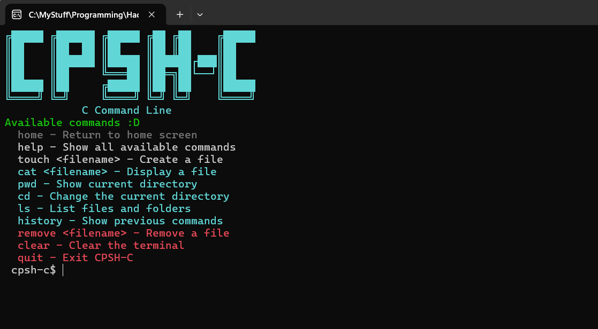
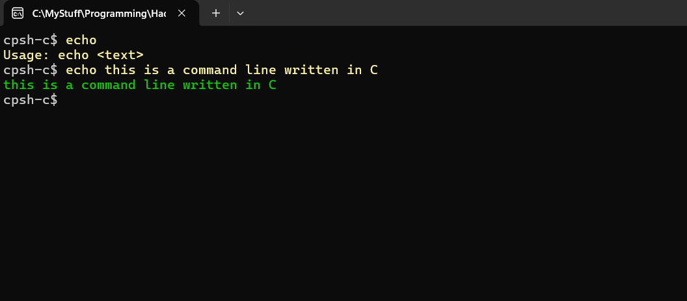

C Command Line
An awesome command line written in C for windows, a version of [cpsh](https://github.com/Sankarshan-T/cpsh) (which was written in C++), now cloned into C!!!

# CPSH-C

## Commands to try out:
- **help**: to show the list of commands
- **home**: to display the ascii art and the commands
- **clear**: to clear the shell
- **echo**: To print something in the shell
- **history**: to display the history of commmands
- **pwd**: To see the current working directory
- **cd**: To change the working directory
- **ls**: To list the elements of the working directory
- **touch**: to create a file in the working directory
- **cat**: To read the contents of a file
- **remove**: To remove a file from the directory
- **exit**: To exit the application

## How to install:
1. Go to the releases page here, and download the latest `cpsh-c.exe` file.
2. Run the exe file normally, and CPSH-C opens in your terminal.
3. Read the commands and try them out!

## Runnning locally:
1. Clone this repository:
git clone https://github.com/Sankarshan-T/cpsh-c
2. Compile all files using:
`gcc main.c parser.c commands.c command-table.c -o my-cpsh-c.exe -static`
3. Then run it with `my-cpsh-c.exe` (for command prompt) or `./my-cpsh-c.exe` (for powershell)

## Made completely using C

## Gallery

